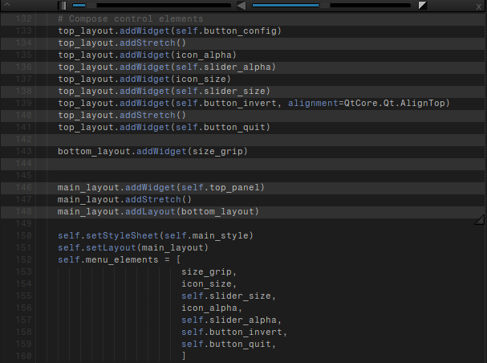
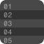

---
##  RowLayer
Translucent window with alternating color lines for overlaying any text,
making rows below appear in different colors.

## Features
 - drag window by holding any part of it
 - hide/show control bar
 - row alpha slider
 - row size slider
 - inverted row color mode
 - resize by dragging bottom right grip

 ## Dependencies
  - Python 3
  - PyQt5 5.15.9

  ## Run
  > $ python3 rowlayer.py